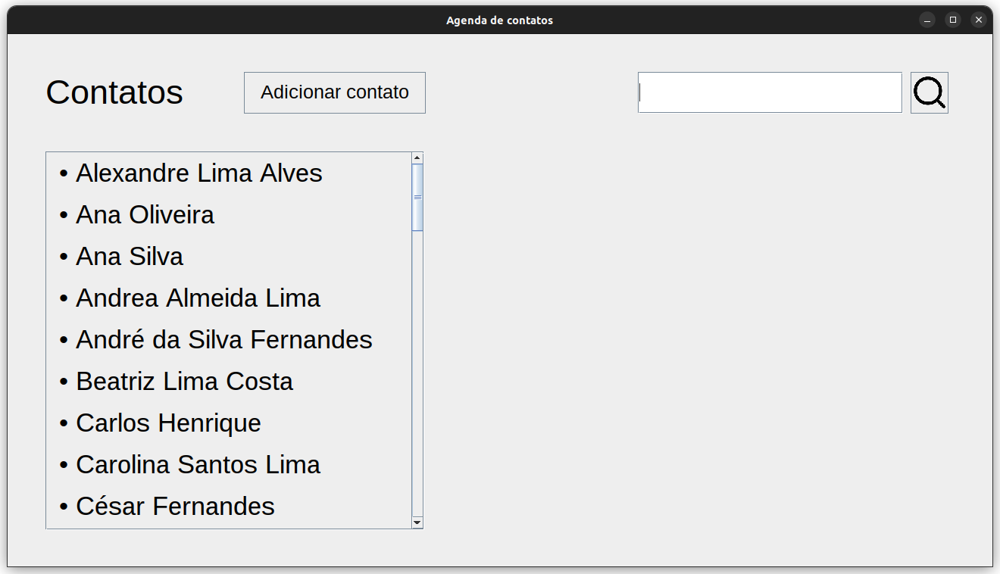

# Address-Book

> Versão 1.0

[![Baixar Aplicação][url-image]][url]

    

## Sobre

Um simples aplicativo de agenda de contatos para desktop. Desenvolvido em Java.

## Como Contribuir

1. Faça um fork do repositório
2. Crie uma branch para sua feature (`git checkout -b feature/MinhaFeature`)
3. Faça commit das suas mudanças (`git commit -am 'Adiciona uma nova feature'`)
4. Faça push para a branch (`git push origin feature/MinhaFeature`)
5. Abra um Pull Request

## Licença

Este projeto está licenciado sob a Licença MIT - veja o arquivo [LICENSE](LICENSE) para detalhes.

## Contato

- Raphael Vilete - [raphvilete@gmail.com](mailto:raphvilete@gmail.com)

<!-- Markdown link & img dfn's -->
[url]: https://github.com/raphss/Address-Book/raw/main/dist/agenda.exe
[url-image]: https://img.shields.io/badge/Baixar_Aplicação-gray
